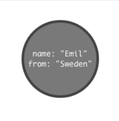

# LearningNeo4J

## Graph Fundamentals

###### ***This notes below can be read on neo4J browser sandbox by type the command: :play concepts***

A graph database can store any kind of data using a few simple concepts:
    1. Nodes - graph data records
    2. Relationships - connect nodes
    3. Properties - named data values

The simplest graph has just a single node with some named values called **Properties**:



The nodes are the name for data records in a graph and the data is stored as Properties that can be simple name/value pairs.

Nodes can be grouped together by applying a Label to each member. In the example above we can set to that node the label **Person**. A node can have zero or more labels, the label is not a object and can not have any properties.

To add more records we can simply add more nodes.


Similar nodes can have different properties with different type: string, numbers or even booleans.
The dimension of a graph like this can be infinite because there is no limit to the number of nodes that can be added.

One of the properties of a database is to connect data, in a graph database the link is made by relationships. To associate two nodes we can add Relationship between them wich describe how the records are related.


A relationship are data records that need to have two properties: direction and type, and can also contains properties like nodes.


## Introduction to Neo4J

### Cypher

###### ***This notes below can be read on neo4J browser sandbox by type the command: :play cypher***
###### ***All of the query are run in the [Neo4J browser sandbox](https://neo4j.com/sandbox-v2)***

Neo4J's Cypher language is purpose built for working with graph data, uses patterns to describe graph data and it's familiar to sql-like clauses and follow this rule: ***describing what to find and not how to find it**.

Let's create a small social graph.
To create a new data we use the *CREATE* clause:

```Cypher
CREATE (ee:Person {name: "Emil", from: "Sweden", klout:99})
```
***klout = influence based on the ability to drive action across the social web***

With this query we create a node **ee** of type Person that have 3 properties: name, from and klout.

The output of this query will be:
```
Added 1 label, created 1 node, set 3 properties, completed after 134 ms.
```


### References

Neo4J:
    - [neo4j browser sandbox](https://neo4j.com/sandbox-v2)
        * :play concepts
        * :play intro